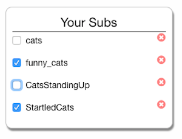
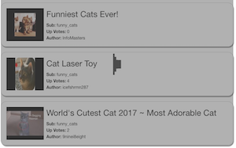

## Reddit Reader

---
### Setup

0. `git clone`
0. navigate to directory
0. `npm run setup`
0. Navigate to localhost:5050

* Server can be stopped using `ctl+c` and re-started using `npm run serve`

---

### Features

0. Autocomplete sub-search


0. Custom Sub-Reddit feed



0. Infinite Scroll



---
### Design

This app was built using **React.js** for view rendering, **Redux.js** for state management, and **Foundation** for responsiveness.

#### State

The most important part of the design for this app was the state shape, which looks like this:


```js
{
  after: {},
  feed: {
    listings: {},
    loading: true/false,
    order: []
  },
  filter: "HOT",
  subList: [{name: "cats", selected: true}, {} ...],
  subSearchResults: ["dogs", "dog_pics", "funny_dogs" ...]
}
```

* `after` -- an object used to track the last listing loaded for each sub-reddit
* `feed.listings` -- an object with unique identifiers as keys and objects with listing information as values
* `feed.loading` -- a boolean that causes the loading spinner to show/hide
* `feed.order` -- an array of identifiers that specifies the render order
* `filter` -- a string used to specify what type filter is applied to the reddit query
* `subList` -- an array of sub-reddit objects with `name` and `selected` attributes - these are shown in the feed
* `subSearchResults` -- an array of sub-reddit names - these are the results of searching for sub-reddits to subscribe to

#### Components

The React component hierarchy looks like this:

```
Root
  Feed
    Listing
      Details
    Spinner
  SubManager
    Filters
    SubList
    SubSearch
```

* `Feed` -- This component renders a set of listings and toggles the display of the loading spinner.
  * `Listing` -- This component decides which _style_ of listing to create, based on whether or not the listing has an accompanying photo.
  * `Details` -- Extracts important information from each listing object.
  * `Spinner` -- It spins and spins!
* `SubManager` -- This component simply wraps three other components that are used to manage which subs and listings the users sees.
  * `Filters` -- Allows the user to toggle which subset of listings they want: Hot, New, etc.
  * `SubList` -- Displays a list of all the subs a user has added to their profile. They can toggle the sub on or off while keeping it in their list.
  * `SubSearch` -- Autocomplete search feature that allows users to add new sub-reddits to their feed.

---

### Approach Summary

My basic approach to building this app was to store all relevant query & filter information in the application state, and to build a reddit api wrapper that deconstructed the application state into an appropriate query. Then, build a listener such that every time the application state changes, the query fires.

If a user has subscribed to multiple sub-reddits, then a separate query is fired for each. The results are then randomly merged together when generating the new application state. If the user has no sub-reddits configured, then the reddit home page content is shown instead.

### Improvements

* No user information (such as filter or sub-reddit preferences) persists between page refreshes. This could be implemented without a backend by using the Local Storage api.

* Right now, the user has to make a separate request for each sub-reddit they subscribe to. Since browsers can only make 4-6 simultaneous http requests, this process may become a bottleneck for users with a large number of sub-reddits. This could be alleviated by building a web server that could pre-process the browser's request for multiple sub-reddits and then spin up multiple sub-processes to handle each request. This would streamline communication with the Reddit api and reduce the number of requests burdened unto the browser.

* The imposed limit on requests for listings is 10, regardless of how many subs the users has subscribed to. If the user configures 1 sub, they will scroll through 10 listings before the 'infinite scroll' request is triggered. If the user configures 10 subs, they have to view 100 listings before reaching the end of the list and re-fetching. This is inconsistent and a bad user experience. Moving forward, I would aim for 15 - 20 listings per request, evenly divided by the number of subs that are configured.

* Every time a user toggles a filter, adds, or removes a sub, the app dumps it's previous feed and re-fetches the entire feed. While in some instances this is necessary - such as changing a filter - in many instances this is wasteful and unnecessary. For example, if a user unsubscribes from a sub, we can merely remove the listings from the state that belong to that sub. No need to re-fetch! This would speed up some filtering processes for the user.

* Some sub-reddits are private or require special permissions to view. The listings for these sub-reddits are unavailable on the public api. Right now, if the user subscribes to one of these sub-reddits, they simply see nothing from that sub. It would be better practice to alert the user that this sub-reddit is unavailable.
