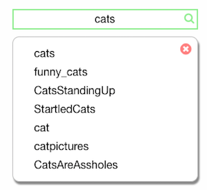

## Reddit Reader

---

#### Setup

0. git clone
0. navigate to directory
0. `npm run setup`
0. Navigate to localhost:5050

* Server can be stopped using `ctl+c` and re-started using `npm run serve`

#### Features

0. Autocomplete sub-search

0. Custom Sub-Reddit feed

0. Infinite Scroll


---

#### Design

This app was built using react for view rendering and redux for state management. The most important part of the design for this app was the state shape, which looks like this:

```js
{
  after: {},
  feed: {
    listings: {},
    loading: true/false,
    order: []
  },
  filter: "HOT",
  subList: ["cats", "silly_cats" ...],
  subSearchResults: ["dogs", "dog_pics", "funny_dogs" ...]
}
```
